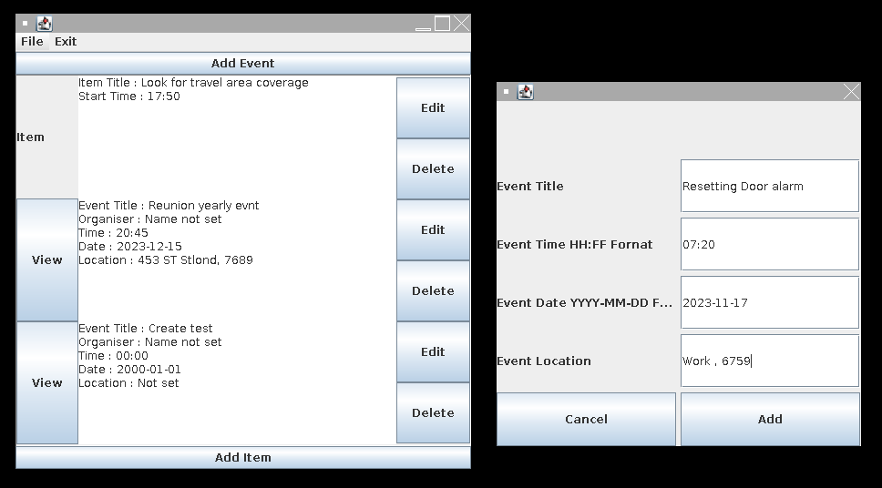
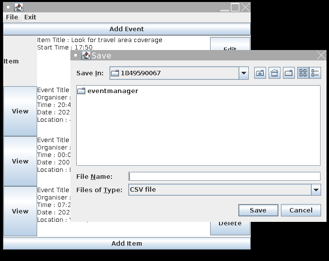
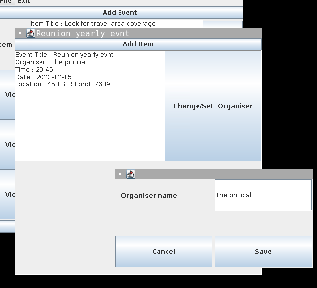

This project contains the EventManager Coursework as a NetBeans Project for K2056101
Possible from extensive use of documentation of packages from docs.oracle.com/javase/8/docs/api/overview-summary.html

A Java swing application (GUI)
In Model View Controller Format
Event manager  with the following features:
    Create, View, Edit, and Delete events with:
        Title
        Time
        Date
        Location(Text)
        SUB items:
            Title
            Start time
            
    Features:
    Save and load from the file system (custom function that saves and uses strings)
        Input error checking for time
        The scroll view is generally a good user interface for what's available with swing packages.
Available in: https://replit.com/@ELIATHEONE/Event-Manager-Live#Main.java

## Add event and sample window filled

## View event and set organizer

## Edit window

## Save and load the window using the file picker

